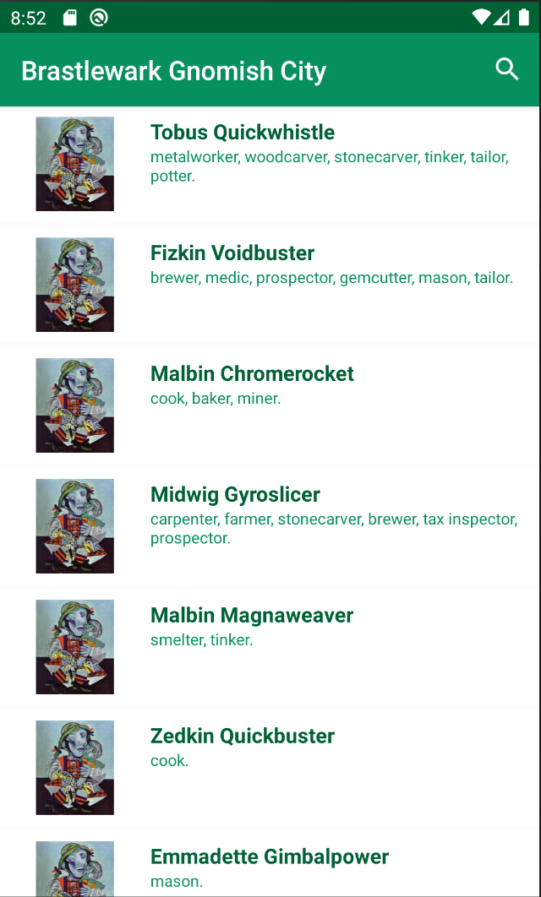
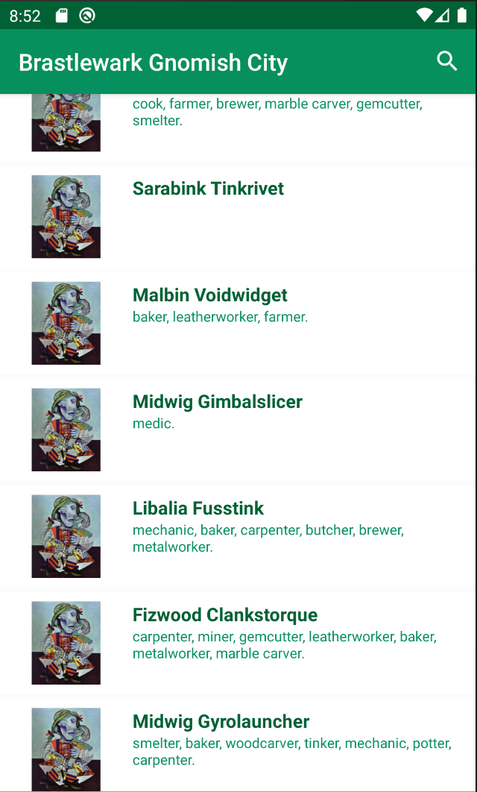
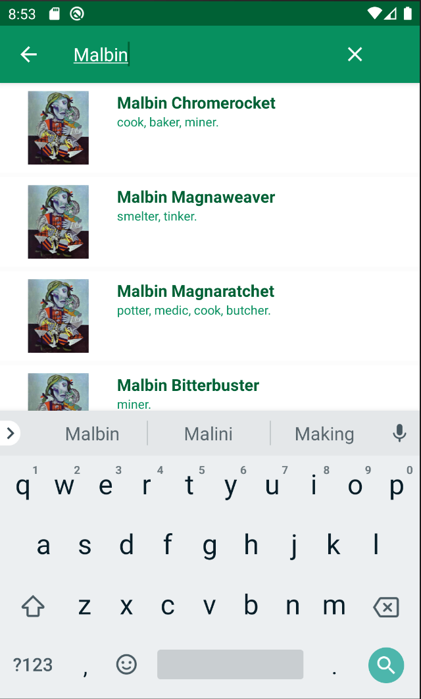
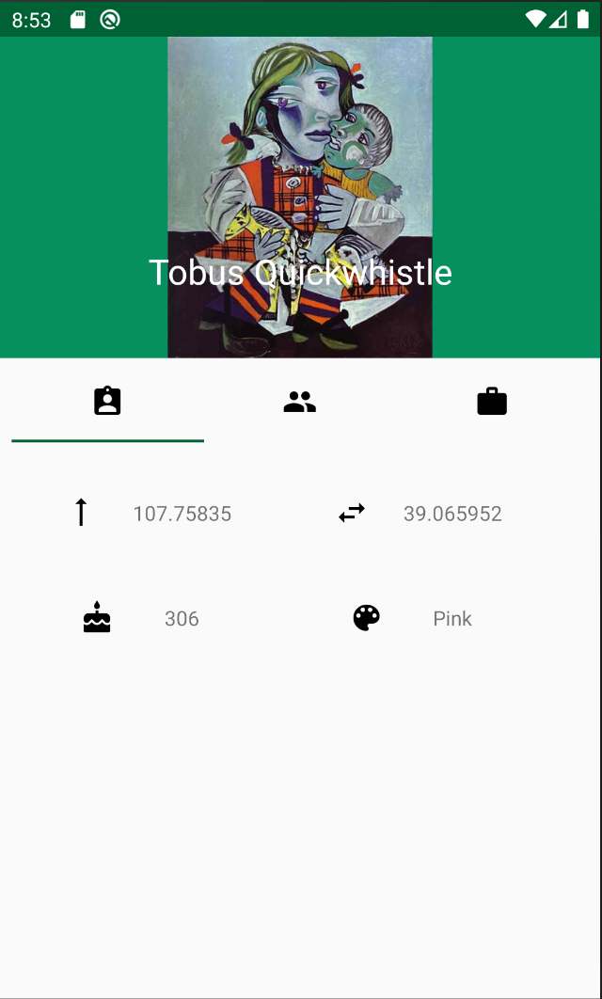
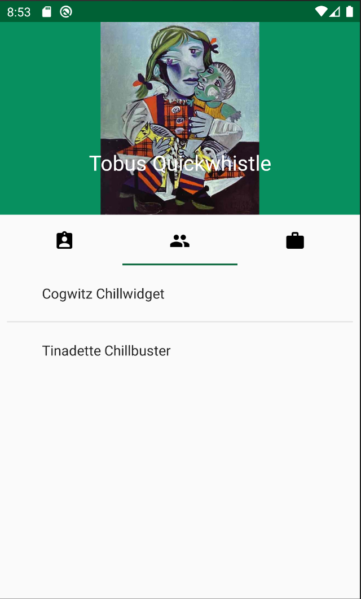
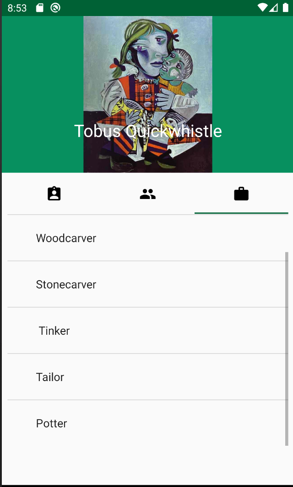

# BrastlewarkGnomes
_An android example app with lists and getting data from json._

## Some screenshots:

  
  
  

## Project settings:

- [Dagger 2](https://dagger.dev/): A dependency injection framework.
- [Butterknife](https://jakewharton.github.io/butterknife/): Field and method binding for Android views. 

- [Retrofit](https://square.github.io/retrofit/): A type-safe HTTP client for Android and Java.
- [GSON](https://github.com/google/gson): Convert Java Objects into their JSON representation.

- [Picasso](https://square.github.io/picasso/): An image downloading and caching library for Android.

- [Junit4](https://junit.org/junit4/): A framework to write repeatable tests.
- [Mockito](https://site.mockito.org/): Mocking framework for unit tests in Java.
- [Espresso](https://developer.android.com/training/testing/espresso): Android UI tests.

- [Support libraries](https://developer.android.com/topic/libraries/support-library): Support multiple API versions.

## Source: 
[BrastlewarkGnomes](https://github.com/DavidHerreroJimenez/BrastlewarkGnomes)
